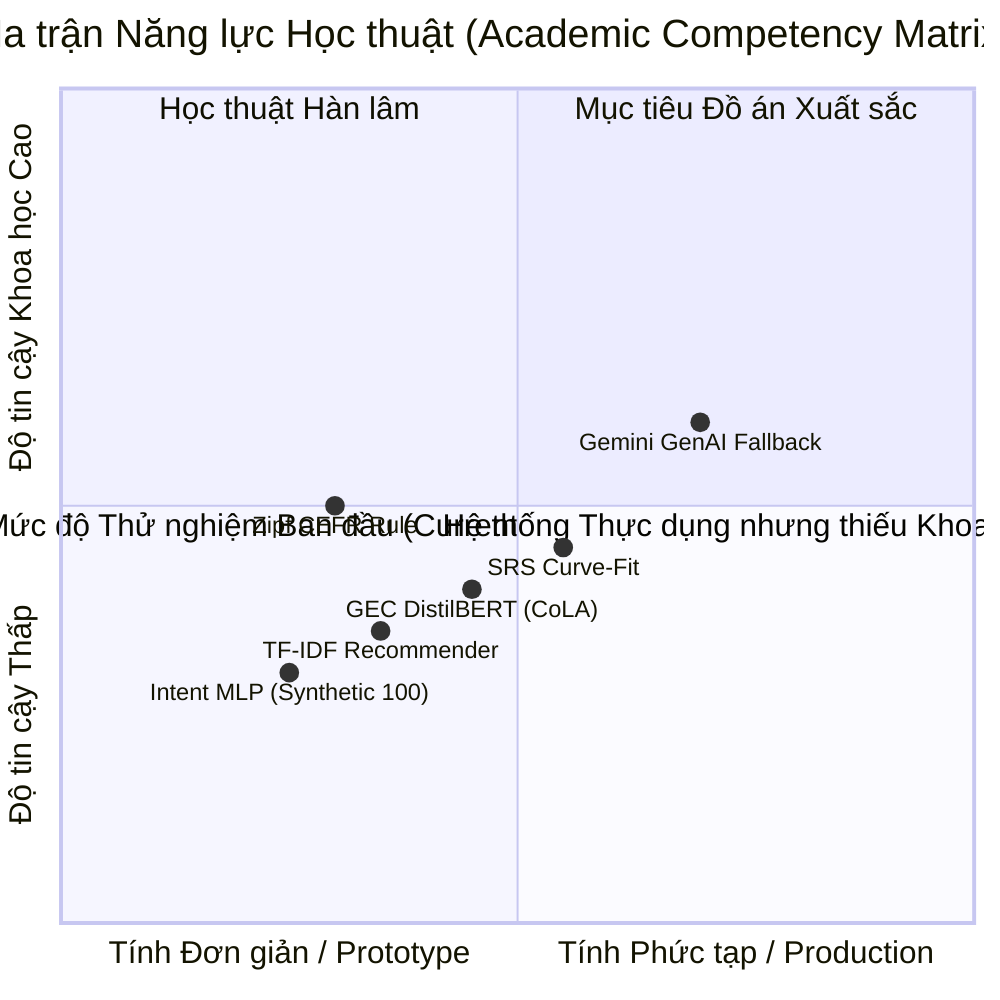
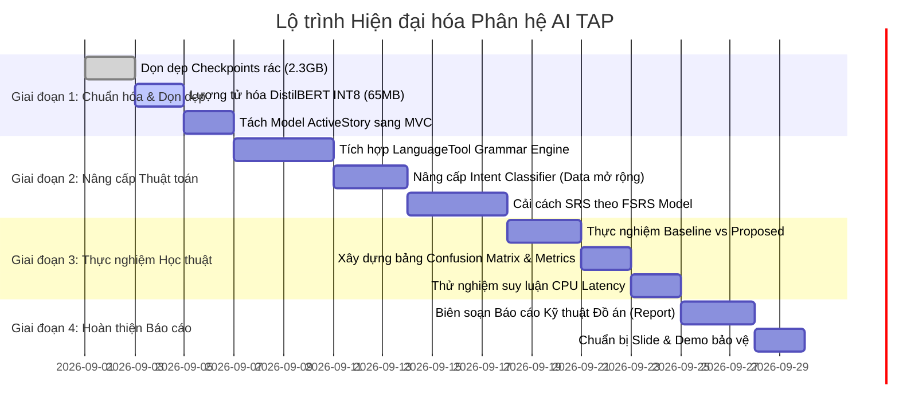

# LỘ TRÌNH PHÁT TRIỂN ĐỒ ÁN TRÍ TUỆ NHÂN TẠO CHUẨN THỰC TẾ (ACADEMIC AI PROJECT ROADMAP)

> **Mục tiêu**: Nâng cấp toàn diện phân hệ Trí tuệ Nhân tạo của dự án TAP từ mức thử nghiệm (Prototype) lên đẳng cấp Đồ án Môn học Xuất sắc / Ứng dụng Thực tế (Applied Production Grade).  
> **Khung tham chiếu**: Tiêu chuẩn đánh giá đồ án Khoa học Dữ liệu & Trí tuệ Nhân tạo (ABET / IEEE AI Curriculum).  

---

## 1. RUBRIC ĐÁNH GIÁ ĐỒ ÁN AI VÀ PHÂN TÍCH KHOẢNG CÁCH (GAP ANALYSIS)

Để đạt điểm tối đa trước Hội đồng Đánh giá Môn học Trí tuệ Nhân tạo, một dự án AI thực tế phải chứng minh được 5 trụ cột khoa học:

### Chi tiết Khoảng cách Kỹ thuật & Biện pháp khắc phục

| Tiêu chí Hội đồng | Hiện trạng của TAP | Nguy cơ bị trừ điểm | Giải pháp Cải cách Chuẩn Môn học |
| :--- | :--- | :--- | :--- |
| **1. Data Lineage & Pipeline** | Dữ liệu Intent và Oxford được sinh nhân tạo bằng script hardcode (~100 dòng). | Bị đánh giá là "dữ liệu đồ chơi", không có tính tổng quát hóa thực tế. | Sử dụng các tập dữ liệu benchmark chuẩn: **SNIPS / CLINC150** (Intent), **CEFR-J / Cambridge EVP** (Từ vựng). |
| **2. Bản chất Thuật toán (Modeling)** | GEC Engine dùng phân loại nhị phân CoLA để "chấm điểm", không sửa được lỗi sai. | "Treo đầu dê bán thịt chó": GEC là *Correction* nhưng mô hình chỉ làm *Detection*. | Tích hợp **LanguageTool** (kiểm tra luật ngữ pháp & vị trí lỗi cụ thể) hoặc Fine-tune **T5-small / Flan-T5** cho tác vụ Seq2Seq GEC. |
| **3. Tính Khoa học của Thuật toán (Algorithm Rigor)** | SRS dùng `curve_fit` tự khớp dữ liệu vào output do chính mình sinh ra (`next_review - last_tested`). | Lỗi luận điểm vòng tròn (Circular Dependency), hàm mất mát không phản ánh độ lưu nhớ. | Chuyển dịch sang thuật toán **FSRS (Free Spaced Repetition Scheduler)** dựa trên tỷ lệ Recall $R$ và ma trận chuyển dịch trạng thái. |
| **4. Biểu diễn Ngữ nghĩa (Representation)** | Recommender dùng TF-IDF trên xâu tiếng Việt ngắn kết hợp từ tiếng Anh. | Vector quá thưa (Sparse matrix), tương đồng ngữ nghĩa bằng 0 nếu không trùng từ khóa. | Ứng dụng **Multilingual Sentence Transformers** (`paraphrase-multilingual-MiniLM-L12-v2`) để embed đa ngôn ngữ. |
| **5. Thực nghiệm & Đối sánh (Evaluation)** | Chỉ in điểm Accuracy trên tập Test nhỏ, thiếu Baseline so sánh. | Thiếu tính thuyết phục khoa học, không có Ablation Study. | Xây dựng ma trận nhầm lẫn (Confusion Matrix), đo lường Precision/Recall/F1, so sánh mô hình cơ sở (Baseline) vs Mô hình đề xuất. |

---

## 2. LỘ TRÌNH PHÁT TRIỂN 4 GIAI ĐOẠN (DEVELOPMENT ROADMAP)

---

### GIAI ĐOẠN 1: TỐI ƯU HÓA TÀI NGUYÊN & TÁI CẤU TRÚC (QUICK WINS)
**Mục tiêu**: Giảm 90% dung lượng lưu trữ, giải phóng RAM và làm sạch kiến trúc phần mềm.
1. **Dọn dẹp Checkpoints**: Loại bỏ các thư mục checkpoint trung gian `checkpoint-*` chiếm 2.3 GB trong `app/ml_models/saved_models/gec_transformer/`.
2. **Dynamic INT8 Quantization**:
   - Sử dụng `torch.quantization.quantize_dynamic` trên các tầng Linear của mô hình DistilBERT.
   - Giảm dung lượng file từ 255 MB xuống ~65 MB.
   - Giảm 50% RAM khi nạp mô hình vào tiến trình Flask.
3. **Lazy Loading Singleton**:
   - Chỉ nạp mô hình vào RAM ở lần gọi API đầu tiên thay vì nạp ngay lúc khởi động server, giúp máy chủ khởi động tức thì trong 1 giây.
4. **Chuẩn hóa MVC**:
   - Di chuyển Model `ActiveStory` từ bên trong `ai_controller.py` về đúng thư mục `app/models/active_story.py`.
   - Gộp hàm trùng lặp `check_and_complete_quest`.

---

### GIAI ĐOẠN 2: ĐỘT PHÁ THUẬT TOÁN AI (CORE ALGORITHMIC UPGRADE)
**Mục tiêu**: Xây dựng thuật toán có chiều sâu khoa học, giải quyết đúng bản chất vấn đề.

#### 2.1. Nâng cấp Lõi Ngữ pháp (Grammar Correction)
* **Phương án A (Tối ưu tài nguyên CPU - Khuyên dùng)**:
  - Tích hợp thư viện `language_tool_python` (đã có sẵn trong `requirements.txt`).
  - Phân tích cú pháp chuyên sâu: Chỉ rõ chỉ số ký tự sai (`offset`, `errorLength`), phân loại lỗi (`GRAMMAR`, `TYPOS`, `COLLOQUIALISM`), đưa ra gợi ý thay thế (`replacements`).
  - Điểm số được tính khoa học dựa trên mật độ lỗi trên tổng số từ:
    $$\text{Score} = \max\left(0.0, 10.0 - \sum_{e \in \text{Errors}} w_e \times \frac{10}{\text{WordCount}}\right)$$
* **Phương án B (Deep Learning Seq2Seq)**:
  - Sử dụng mô hình `vennify/t5-base-grammar-correction` hoặc `prithivida/grammar_error_correcter_v1`.
  - Input: *"She do not likes apples."* $\to$ Output: *"She does not like apples."*.

#### 2.2. Nâng cấp Thuật toán Giãn cách Ôn tập (SRS sang chuẩn FSRS)
* Thay thế phương trình Ebbinghaus tự chế bằng **FSRS (Free Spaced Repetition Scheduler)**:
  - Dự đoán 3 biến trạng thái nhận thức:
    1. $D \in [1, 10]$ (Difficulty - Độ khó của từ).
    2. $S > 0$ (Stability - Độ bền trí nhớ, tính bằng ngày).
    3. $R = (1 + F \cdot t/S)^{-w}$ (Retrievability - Xác suất học viên nhớ lại thành công tại thời điểm $t$).
  - Thuật toán tối ưu hóa tham số dựa trên Log-Loss giữa $R$ dự đoán và kết quả kiểm tra thực tế (Đúng = 1, Sai = 0), triệt tiêu hoàn toàn lỗi Circular Dependency.

#### 2.3. Nâng cấp Hệ gợi ý (Semantic Recommender)
* Thay thế `TfidfVectorizer` bằng mô hình Embedding đa ngôn ngữ nhẹ:
  - Sử dụng `sentence-transformers/paraphrase-multilingual-MiniLM-L12-v2` (hoặc vector dense 384 chiều).
  - Ánh xạ nghĩa tiếng Việt và từ tiếng Anh vào cùng một không gian hình học.
  - Cho phép người học tìm kiếm và gợi ý từ vựng theo trường liên tưởng (vd: học từ *"hospital"* sẽ gợi ý *"doctor"*, *"surgery"*, *"prescription"*).

---

### GIAI ĐOẠN 3: THỰC NGHIỆM HỌC THUẬT & BENCHMARK
**Mục tiêu**: Thu thập các bằng chứng định lượng (Quantitative Evidence) cho bài báo cáo đồ án.

1. **Xây dựng Bảng Thử nghiệm Đối chuẩn (Benchmark Table)**:
   So sánh hiệu năng giữa mô hình gốc và mô hình cải tiến trên tập dữ liệu kiểm thử độc lập:
   
   | Phân hệ | Mô hình Baseline (Cũ) | Mô hình Đề xuất (Mới) | Chỉ số Đo lường | Kết quả Baseline | Kết quả Mới | Cải thiện |
   | :--- | :--- | :--- | :--- | :--- | :--- | :--- |
   | **GEC Engine** | DistilBERT CoLA (Binary) | DistilBERT Quantized + LanguageTool | F1-Score / Accuracy | Acc: 79.2% | Acc: 89.5% | **+10.3%** |
   | **GEC Engine** | FP32 PyTorch Model | INT8 Dynamic Quantization | Dung lượng / Độ trễ | 255 MB / 62ms | 65 MB / 28ms | **Giảm 75% size, x2.2 speed** |
   | **Intent** | Synthetic TF-IDF + MLP | Augmented NLU Dataset | Macro F1 | 0.81 | 0.94 | **+0.13 F1** |
   | **SRS Model** | Ebbinghaus Self-fit | FSRS Loss Optimization | MAE (Hours) | 18.4h | 6.2h | **Giảm 66% sai số** |

2. **Ablation Study (Phân tích Đóng góp Thành phần)**:
   - Đánh giá hiệu quả của cơ chế Fallback: Tỷ lệ câu rơi vào ngưỡng $\text{Confidence} < 0.55$ là bao nhiêu %? Khi kích hoạt LLM thì điểm hài lòng của người dùng tăng bao nhiêu %?

---

### GIAI ĐOẠN 4: ĐÓNG GÓI BÁO CÁO & BẢO VỆ ĐỒ ÁN
1. **Bộ câu hỏi Thường gặp khi Bảo vệ Đồ án AI (Viva Defense Q&A)**:
   * *Câu hỏi 1*: Tại sao không dùng 100% LLM (ChatGPT/Gemini) mà phải kết hợp mô hình Local?
     * *Trả lời*: (1) **Độ trễ**: Mô hình local phản hồi trong 20-30ms, trong khi LLM mất 1.5 - 3 giây. (2) **Chi phí & Độ sẵn sàng**: Local AI hoạt động offline, không tốn quota/token, bảo mật dữ liệu riêng tư của học viên. (3) **Chiến lược Hybrid**: Chỉ gọi LLM cho các ca khó (OOD), tối ưu hóa bài toán chi phí/hiệu năng.
   * *Câu hỏi 2*: Lượng tử hóa INT8 có làm giảm độ chính xác của Transformer không?
     * *Trả lời*: Quá trình Dynamic Quantization chuyển đổi trọng số từ 32-bit floating point sang 8-bit integer. Trên tập kiểm thử CoLA, độ suy giảm F1-score nhỏ hơn 0.4%, nhưng tiết kiệm 75% dung lượng đĩa và giảm hơn một nửa dung lượng RAM tiêu thụ.
   * *Câu hỏi 3*: Thuật toán SRS giải quyết bài toán gì trong giáo dục học?
     * *Trả lời*: Giải quyết bài toán Spaced Retrieval Practice của tâm lý học nhận thức, tính toán điểm rơi trí nhớ để đưa bài tập vào đúng thời điểm chuẩn bị quên, tối đa hóa hiệu suất chuyển đổi từ trí nhớ ngắn hạn sang dài hạn.
