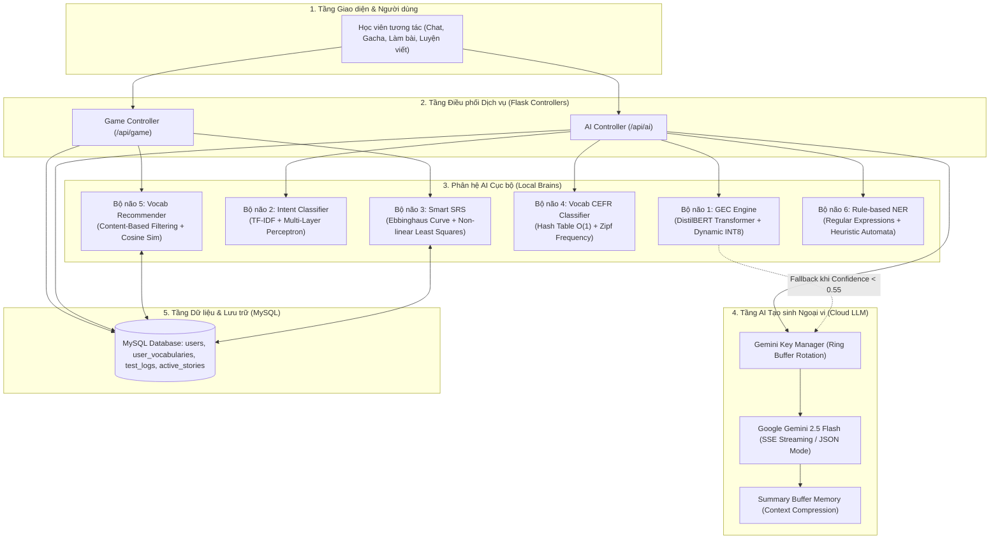

# TÀI LIỆU ĐẶC TẢ HỆ THỐNG VÀ THUẬT TOÁN TRÍ TUỆ NHÂN TẠO (AI SYSTEM SPECIFICATION)

> **Dự án**: TAP (Global Fluent / Master G English Learning Platform)  
> **Phân hệ**: AI / Machine Learning & Natural Language Processing (NLP)  
> **Phiên bản tài liệu**: 2.0 (Academic & Production Specification)  
> **Tiêu chuẩn**: Đáp ứng đồ án môn học Trí tuệ Nhân tạo / Khoa học Dữ liệu ứng dụng  

---

## 1. TỔNG QUAN KIẾN TRÚC HỆ THỐNG AI (MULTI-BRAIN ARCHITECTURE)

Hệ thống AI của dự án TAP được thiết kế theo mô hình **Hybrid Edge-Cloud AI (Trí tuệ nhân tạo lai)**. Hệ thống chia tách nhiệm vụ giữa **Local AI Engines** (các mô hình học máy, mạng nơ-ron và thuật toán tối ưu chạy cục bộ trên CPU máy chủ với độ trễ thấp) và **Cloud Generative AI** (mô hình ngôn ngữ lớn Google Gemini phục vụ các tác vụ sinh nội dung sáng tạo và ngữ cảnh mở).

---

## 2. ĐẶC TẢ CHI TIẾT TỪNG THUẬT TOÁN AI

---

### 2.1. Bộ não 1: Grammar Error Detection (GEC Engine)
* **Tệp mã nguồn**: [`app/ml_models/gec_engine.py`](file:///d:/Python/TAP/app/ml_models/gec_engine.py), [`scripts/train_gec.py`](file:///d:/Python/TAP/scripts/train_gec.py)
* **Loại bài toán**: Phân loại chuỗi văn bản nhị phân (Binary Sequence Classification).
* **Kiến trúc mô hình**: `DistilBERT` (`distilbert-base-uncased`) - một phiên bản chắt lọc (knowledge distillation) từ BERT, giảm 40% số tham số (66M thay vì 110M) trong khi vẫn giữ 97% năng lực hiểu ngôn ngữ tự nhiên.
* **Tập dữ liệu huấn luyện**: **CoLA (The Corpus of Linguistic Acceptability)** thuộc bộ GLUE Benchmark, gồm 8.551 câu gán nhãn khả năng chấp nhận được về mặt ngữ pháp (1: Acceptable, 0: Unacceptable).

#### Mô hình Toán học
1. **Biểu diễn đầu vào (Input Representation)**:
   Chuỗi ký tự đầu vào $X = (x_1, x_2, \dots, x_T)$ được biến đổi qua bộ Tokenizer thành chuỗi WordPiece IDs kèm các token đặc biệt:
   $$\mathbf{H}_0 = [\mathbf{e}_{[\text{CLS}]}, \mathbf{e}_1, \dots, \mathbf{e}_T, \mathbf{e}_{[\text{SEP}]}]$$

2. **Cơ chế Self-Attention đa đầu (Multi-Head Self-Attention)**:
   Tại mỗi tầng Transformer block $l \in [1, 6]$:
   $$\text{Attention}(\mathbf{Q}, \mathbf{K}, \mathbf{V}) = \text{softmax}\left(\frac{\mathbf{Q}\mathbf{K}^T}{\sqrt{d_k}}\right)\mathbf{V}$$

3. **Tầng phân loại (Classification Head)**:
   Vector đại diện của toàn bộ câu tại token $[\text{CLS}]$ được đưa qua tầng tuyến tính (Linear layer) để tạo ra Logits $\mathbf{z} = [z_0, z_1]$:
   $$\mathbf{z} = \mathbf{W} \mathbf{h}_{[\text{CLS}]} + \mathbf{b}, \quad \mathbf{W} \in \mathbb{R}^{2 \times 768}, \mathbf{b} \in \mathbb{R}^2$$

4. **Xác suất Softmax (Probability Distribution)**:
   $$P(\text{Acceptable} \mid X) = \frac{e^{z_1}}{e^{z_0} + e^{z_1}}, \quad P(\text{Unacceptable} \mid X) = \frac{e^{z_0}}{e^{z_0} + e^{z_1}}$$

5. **Đo lường độ bất định & Cơ chế Hybrid Fallback**:
   Độ tự tin (Confidence score) của mô hình cục bộ:
   $$\text{Confidence}(X) = \max\Big(P(\text{Unacceptable} \mid X), P(\text{Acceptable} \mid X)\Big)$$
   
   $$\text{Decision}(X) = \begin{cases} 
   \text{Local Scoring} & \text{nếu } \text{Confidence}(X) \ge \tau = 0.55 \\
   \text{Trigger LLM Fallback (Gemini)} & \text{nếu } \text{Confidence}(X) < \tau = 0.55 
   \end{cases}$$

6. **Thang điểm chấm (Scoring Function)**:
   $$\text{Score}_{\text{local}} = \text{round}(P(\text{Acceptable} \mid X) \times 10, 1)$$

7. **Hàm mất mát khi huấn luyện (Cross-Entropy Loss)**:
   $$\mathcal{L}_{\text{CE}} = - \frac{1}{N} \sum_{i=1}^N \Big[ y_i \log(\hat{y}_i) + (1 - y_i) \log(1 - \hat{y}_i) \Big]$$

* **Độ phức tạp tính toán**: $O(T^2 \cdot d)$ với $T \le 128$ (độ dài câu tối đa), $d=768$.

---

### 2.2. Bộ não 2: Nhận diện Ý định (Intent Classifier)
* **Tệp mã nguồn**: [`app/ml_models/intent_classifier.py`](file:///d:/Python/TAP/app/ml_models/intent_classifier.py), [`app/ml_models/train_intent.py`](file:///d:/Python/TAP/app/ml_models/train_intent.py)
* **Loại bài toán**: Phân loại văn bản đa lớp (Multi-class Text Classification).
* **Không gian nhãn** $\mathcal{Y} = \{\text{ask\_vocab}, \text{ask\_grammar}, \text{story\_action}, \text{general\_chat}\}$.

#### Mô hình Toán học
1. **Trích xuất đặc trưng TF-IDF (Term Frequency - Inverse Document Frequency)**:
   Với mỗi từ hoặc cụm n-gram $t \in \{1, 2\}$ trong văn bản $d$:
   $$\text{TF}(t, d) = \frac{f_{t, d}}{\sum_{t' \in d} f_{t', d}}$$
   $$\text{IDF}(t, D) = \log\left(\frac{1 + |D|}{1 + |\{d \in D : t \in d\}|}\right) + 1$$
   $$\mathbf{x}_d = \text{TF-IDF}(t, d, D) = \text{TF}(t, d) \times \text{IDF}(t, D)$$
   Sau đó vector $\mathbf{x}_d$ được chuẩn hóa theo chuẩn L2: $\mathbf{x} = \frac{\mathbf{x}_d}{\|\mathbf{x}_d\|_2}$.

2. **Kiến trúc Mạng Nơ-ron Đa tầng (Multi-Layer Perceptron - MLP)**:
   Mạng gồm 1 tầng đầu vào ($M$ đặc trưng TF-IDF), 2 tầng ẩn ($H_1 = 100$, $H_2 = 50$) và 1 tầng đầu ra ($K = 4$ lớp):
   $$\mathbf{a}^{(1)} = \text{ReLU}\left(\mathbf{W}^{(1)} \mathbf{x} + \mathbf{b}^{(1)}\right), \quad \mathbf{W}^{(1)} \in \mathbb{R}^{100 \times M}$$
   $$\mathbf{a}^{(2)} = \text{ReLU}\left(\mathbf{W}^{(2)} \mathbf{a}^{(1)} + \mathbf{b}^{(2)}\right), \quad \mathbf{W}^{(2)} \in \mathbb{R}^{50 \times 100}$$
   $$\mathbf{z} = \mathbf{W}^{(3)} \mathbf{a}^{(2)} + \mathbf{b}^{(3)}, \quad \mathbf{W}^{(3)} \in \mathbb{R}^{4 \times 50}$$
   Trong đó hàm kích hoạt phi tuyến $\text{ReLU}(z) = \max(0, z)$.

3. **Xác suất phân lớp**:
   $$P(y = c \mid \mathbf{x}) = \frac{e^{z_c}}{\sum_{j=1}^4 e^{z_j}}, \quad \hat{y} = \arg\max_{c \in \mathcal{Y}} P(y = c \mid \mathbf{x})$$

4. **Thuật toán tối ưu hóa**: Adam (Adaptive Moment Estimation) kết hợp L2 Regularization (Weight Decay $\alpha = 0.0001$).
* **Độ phức tạp tính toán**: $O(M \cdot H_1 + H_1 \cdot H_2 + H_2 \cdot K)$, thời gian suy luận $\le 2\text{ms}$ trên CPU.

---

### 2.3. Bộ não 3: Dự đoán chu kỳ ôn tập thông minh (Smart SRS)
* **Tệp mã nguồn**: [`app/ml_models/srs_predictor.py`](file:///d:/Python/TAP/app/ml_models/srs_predictor.py), [`app/ml_models/retrain_srs.py`](file:///d:/Python/TAP/app/ml_models/retrain_srs.py)
* **Loại bài toán**: Hồi quy phi tuyến tính (Non-linear Regression) dự đoán khoảng thời gian lưu giữ trí nhớ (Memory Retention Interval).

#### Cơ sở Lý thuyết & Mô hình Toán học
Dựa trên giả thuyết Đường cong lãng quên của Hermann Ebbinghaus ($R = e^{-t/S}$, trong đó $R$ là độ giữ lại trí nhớ, $S$ là độ bền vững của trí nhớ):
$$\Delta t_{\text{next}} = \theta_0 + \left( \Delta t_{\text{prev}} \times \theta_1 \right) \cdot \exp\Big( -\theta_2 \cdot \text{fail\_count} - 0.1 \cdot \text{response\_time} \Big)$$

Trong đó:
* $\Delta t_{\text{prev}}$: Khoảng thời gian ôn tập của chu kỳ trước đó (tính bằng giờ, mặc định khởi đầu $\Delta t_0 = 24.0\text{h}$).
* $\text{fail\_count} \in \mathbb{N}$: Số lần học viên chọn đáp án sai từ trước tới nay đối với từ này.
* $\text{response\_time} \in \mathbb{R}^+$: Thời gian phản xạ trả lời câu hỏi (giây).
* $\boldsymbol{\theta} = [\theta_0, \theta_1, \theta_2]$: Vector tham số mô hình cần tối ưu hóa:
  * $\theta_0$: Khoảng thời gian cơ sở (Base interval, khởi tạo $12.0\text{h}$, cận $[1.0, 24.0]$).
  * $\theta_1$: Hệ số giãn nở chu kỳ (Retention multiplier, khởi tạo $1.5$, cận $[1.0, 3.0]$).
  * $\theta_2$: Hệ số trừng phạt sai sót (Fail penalty exponent, khởi tạo $0.8$, cận $[0.1, 2.0]$).

#### Thuật toán Ước lượng Tham số (Curve Fitting via Non-linear Least Squares)
Khi số lượng bản ghi ôn tập thực tế $N \ge 10$, hệ thống kích hoạt thuật toán **Trust Region Reflective (TRF)** để cực tiểu hóa hàm mục tiêu:
$$\min_{\boldsymbol{\theta}} \sum_{i=1}^N \Big( y_i - f(\mathbf{x}_i, \boldsymbol{\theta}) \Big)^2 \quad \text{với } \mathbf{l} \le \boldsymbol{\theta} \le \mathbf{u}$$
Đánh giá độ lệch bằng sai số tuyệt đối trung bình:
$$\text{MAE} = \frac{1}{N} \sum_{i=1}^N \left| y_i - \hat{y}_i \right|$$

#### Cơ chế Bảo vệ Trực quan (Boundary Clipping)
Để tránh các giá trị ngoại lai (outliers) hoặc suy giảm trí nhớ cực đoan, kết quả được chặn trong khoảng:
$$\Delta t_{\text{clamped}} = \max\Big(0.5\text{h}, \min(\Delta t_{\text{next}}, 24 \times 180\text{h})\Big)$$

---

### 2.4. Bộ não 4: Phân loại cấp độ từ vựng theo khung CEFR
* **Tệp mã nguồn**: [`app/ml_models/vocab_classifier.py`](file:///d:/Python/TAP/app/ml_models/vocab_classifier.py), [`app/ml_models/generate_oxford.py`](file:///d:/Python/TAP/app/ml_models/generate_oxford.py)
* **Loại bài toán**: Phân loại cấp bậc ngôn ngữ theo chuẩn Khung tham chiếu chung Châu Âu (CEFR: A1, A2, B1, B2, C1, C2).

#### Cơ chế Thực thi 2 Tầng (Two-tier Hybrid Algorithm)
1. **Tầng 1: Tra cứu Bảng băm $O(1)$ (Exact Lexicon Match)**:
   Tra cứu từ vựng trong cơ sở dữ liệu `oxford_5000.json` (5.000 từ vựng tiếng Anh học thuật phổ biến nhất). Nếu từ $w \in \text{Dict}$, trả về nhãn CEFR tương ứng ngay lập tức với độ phức tạp $O(1)$.

2. **Tầng 2: Thuật toán Tần suất Định luật Zipf (Zipf Frequency Fallback)**:
   Nếu $w \notin \text{Dict}$ (từ lóng, thuật ngữ chuyên ngành hoặc biến thể ngữ pháp), thuật toán sử dụng thang đo tần suất Zipf từ thư viện `wordfreq`:
   $$z(w) = \log_{10}\left( 10^9 \times P(w) \right) = \log_{10}(P(w)) + 9$$
   Thang điểm $z(w) \in [0.0, 8.0]$ phản ánh mức độ phổ biến trong ngữ liệu ngôn ngữ thực tế (vd: "the" $\approx 7.88$, "apple" $\approx 4.90$):
   $$\text{CEFR}(w) = \begin{cases}
   \text{A2} & \text{nếu } z(w) \ge 5.5 \text{ (Rất phổ biến)} \\
   \text{B2} & \text{nếu } 4.0 \le z(w) < 5.5 \text{ (Phổ biến trung bình)} \\
   \text{C1} & \text{nếu } 0.0 < z(w) < 4.0 \text{ (Từ hiếm gặp)} \\
   \text{C2} & \text{nếu } z(w) = 0.0 \text{ (Từ cực hiếm, tiếng lóng mới xuất hiện)}
   \end{cases}$$

---

### 2.5. Bộ não 5: Hệ gợi ý từ vựng (Vocab Recommender)
* **Tệp mã nguồn**: [`app/ml_models/recommender.py`](file:///d:/Python/TAP/app/ml_models/recommender.py)
* **Loại bài toán**: Lọc dựa trên nội dung (Content-Based Recommendation System).

#### Thuật toán & Không gian Vector
1. **Tạo chuỗi đặc trưng**: Mỗi từ $v$ trong kho từ điển $\mathcal{V}$ được biểu diễn bằng chuỗi ngữ cảnh kết hợp: $\text{Feature}(v) = \text{Theme}_v \mathbin{\Vert} \text{Meaning}_v$.
2. **Không gian vector TF-IDF**: Ánh xạ toàn bộ kho từ vựng thành ma trận $\mathbf{M} \in \mathbb{R}^{|\mathcal{V}| \times D}$.
3. **Độ đo tương đồng Cosine (Cosine Similarity)**:
   $$\text{Sim}(v_i, v_j) = \frac{\mathbf{v}_i \cdot \mathbf{v}_j}{\|\mathbf{v}_i\|_2 \|\mathbf{v}_j\|_2} = \cos(\theta)$$
4. **Hàm xếp hạng gợi ý (Scoring & Ranking)**:
   Gọi $\mathcal{L}_{\text{user}}$ là tập hợp các từ vựng người dùng đã thuộc ($\text{memorization\_level} = \text{'DA\_THUOC'}$):
   $$\forall v_u \notin \mathcal{L}_{\text{user}}, \quad \text{Score}(v_u) = \frac{1}{|\mathcal{L}_{\text{user}}|} \sum_{v_k \in \mathcal{L}_{\text{user}}} \text{Sim}(v_u, v_k)$$
   Hệ thống chọn ra Top-$N$ từ vựng có điểm $\text{Score}$ cao nhất để khuyến nghị học tiếp:
   $$\mathcal{R}_{\text{top-}N} = \arg\operatorname{top-}N_{v_u \notin \mathcal{L}_{\text{user}}} \Big( \text{Score}(v_u) \Big)$$

---

### 2.6. Bộ não 6: Nhận diện thực thể theo luật (Rule-based NER Engine)
* **Tệp mã nguồn**: [`app/ml_models/ner_engine.py`](file:///d:/Python/TAP/app/ml_models/ner_engine.py)
* **Loại bài toán**: Trích xuất thực thể có tên / đối tượng ngữ pháp trọng tâm (Grammar/Vocab Entity Extraction).
* **Phương pháp**: Máy trạng thái hữu hạn xác định (Deterministic Finite Automata qua Regular Expressions):
  * **Chiến thuật 1 (Cụm từ trích dẫn)**: Pattern `r'["\']([^"\']+)["\']'` có độ ưu tiên tuyệt đối $P_1$.
  * **Chiến thuật 2 (Keyword Intent Trigger)**:
    * Khi $\text{Intent} = \text{ask\_grammar}$: Trích xuất chuỗi sau cụm `(cấu trúc|ngữ pháp|mẫu câu)\s+([a-zA-Z\s]+)`.
    * Khi $\text{Intent} = \text{ask\_vocab}$: Trích xuất chuỗi sau `(từ|chữ|từ vựng|nghĩa của)\s+([a-zA-Z\s]+)`.
  * **Chiến thuật 3 (Heuristic Fallback)**: Lọc tập từ dừng $\mathcal{S} = \{\text{i, you, he, she, what, how, is, are, ...}\}$, lấy từ tiếng Anh có độ dài lớn nhất:
    $$e^* = \arg\max_{w \in \text{Tokens}(X) \setminus \mathcal{S}} \text{len}(w)$$

---

### 2.7. Tầng AI Tạo sinh Ngoại vi (Generative AI Orchestration)
* **Tệp mã nguồn**: [`app/utils/gemini_helper.py`](file:///d:/Python/TAP/app/utils/gemini_helper.py), [`app/controllers/ai_controller.py`](file:///d:/Python/TAP/app/controllers/ai_controller.py)
* **Mô hình**: Google Gemini 2.5 Flash thông qua SDK `google-genai`.

#### Các Thuật toán & Kỹ thuật Điều phối
1. **Ring-Buffer Multi-Key Rotation**:
   Để vượt qua giới hạn tầng suất gọi (Rate Limit HTTP 429), hệ thống duy trì danh sách vòng tròn $K = [k_1, k_2, \dots, k_M]$. Khi gặp lỗi quota:
   $$\text{index}_{\text{current}} = (\text{index}_{\text{current}} + 1) \pmod M$$
2. **Sliding Window Token Memory Compression**:
   Khi số lượt hội thoại trong game Text-RPG vượt quá $T_{\max} = 3$ lượt, hệ thống tự động gọi hàm `summarize_context()` để nén ngữ cảnh cũ thành 2-3 câu đại diện:
   $$\mathcal{H}_{\text{compressed}} = \text{Summary}(\mathcal{H}_{1:t-3}) \mathbin{\Vert} \mathcal{H}_{t-2:t}$$
   Giúp giải phóng không gian Context Window và giảm 60-70% chi phí token.
3. **Server-Sent Events (SSE) Token Streaming**:
   Sử dụng giao thức truyền luồng HTTP chunked transfer `text/event-stream` để đẩy từng token phản hồi trực tiếp từ LLM về trình duyệt người dùng mà không cần đợi kết thúc generation.

---

## 3. BẢNG TỔNG HỢP SO SÁNH CÁC THUẬT TOÁN

| Bộ não | Thuật toán / Mô hình | Input | Output | Ưu điểm | Nhược điểm & Ranh giới |
| :--- | :--- | :--- | :--- | :--- | :--- |
| **GEC** | `DistilBERT` (CoLA) | Câu văn tiếng Anh | Điểm số (0-10) + Fallback Flag | Chạy local cực nhanh (~30ms), không tốn quota | Chỉ phân loại đúng/sai nhị phân, chưa sửa từ lỗi |
| **Intent** | `TF-IDF` + `MLP` | Câu chat người dùng | 1 trong 4 nhãn ý định | Nhẹ, chính xác cao trên các mẫu phổ biến | Kém khái quát hóa nếu gặp câu đảo ngữ phức tạp |
| **SRS** | Ebbinghaus Non-linear Fit | Số lần sai, thời gian phản xạ | Thời điểm ôn tập tiếp theo | Tự động thích ứng theo tốc độ quên của học viên | Dữ liệu khởi tạo cần tối thiểu 10 bản ghi |
| **CEFR** | Hash Dictionary + Zipf | Từ vựng đơn lẻ | Cấp độ A1-C2 | Tốc độ tra cứu $O(1)$, bao phủ 100% từ vựng | Zipf chỉ phản ánh độ phổ biến, không phản ánh độ khó |
| **Recommender** | Content-Based Cosine Sim | Lịch sử từ đã thuộc | Top 5 từ vựng gợi ý | Gợi ý đúng ngữ cảnh chủ đề người dùng quan tâm | Không tận dụng được dữ liệu cộng đồng (Collaborative) |
| **NER** | Regular Expressions | Câu văn tự do | Thực thể từ vựng/ngữ pháp | Tốc độ tức thời, độ chính xác 100% nếu đúng cú pháp | Dễ vỡ nếu câu sai chính tả hoặc cấu trúc lạ |
| **GenAI** | Gemini 2.5 Flash + SSE | Prompt + Bối cảnh | Đoạn văn, cốt truyện RPG | Tương tác thông minh, nhập vai tự nhiên, sáng tạo | Phụ thuộc internet và giới hạn quota API |
