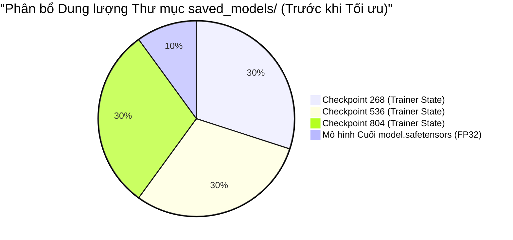

# CẨM NANG TỐI ƯU HÓA DUNG LƯỢNG & BỘ NHỚ CHO HỆ THỐNG AI (FOOTPRINT & MEMORY OPTIMIZATION GUIDE)

> **Mục tiêu**: Hướng dẫn kỹ thuật cắt giảm dung lượng lưu trữ (Storage Footprint) từ **2.55 GB xuống dưới 70 MB** (giảm hơn 97%) và tối ưu hóa bộ nhớ RAM cho ứng dụng web AI.

---

## 1. NGUYÊN NHÂN PHÌNH TO DUNG LƯỢNG TRONG CÁC DỰ ÁN DEEP LEARNING

Trong quá trình huấn luyện các mô hình học sâu (Deep Learning) bằng Hugging Face `Trainer` hoặc PyTorch, dung lượng dự án thường bị phình to đột biến do 3 nguyên nhân chính:

1. **Checkpoints Trung gian (Training Checkpoints)**:
   - Khi cấu hình `save_strategy="epoch"` hoặc `save_steps=...`, mỗi checkpoint lưu lại không chỉ trọng số mô hình (`model.safetensors` ~255 MB) mà còn lưu toàn bộ trạng thái thuật toán tối ưu hóa Adam (`optimizer.pt` ~510 MB) và learning rate scheduler (`scheduler.pt`).
   - Kết quả: Mỗi checkpoint tốn tới **~767 MB**. Với 3 epochs, hệ thống sinh ra 3 thư mục chiếm hơn **2.3 GB**.
   - **Thực tế Production**: Khi triển khai ứng dụng cho người dùng cuối (Inference), hệ thống **hoàn toàn không cần** các file trạng thái của optimizer hay các checkpoint trung gian, mà chỉ cần duy nhất file trọng số cuối cùng!

2. **Định dạng Trọng số 32-bit (Float32 Precision)**:
   - Mô hình `DistilBERT` lưu trữ 66 triệu tham số dưới dạng số thực 32-bit (`FP32`, 4 bytes mỗi tham số), tiêu tốn khoảng $66 \times 10^6 \times 4 \approx 264\text{ MB}$.
   - Khi nạp vào RAM máy chủ, mô hình chiếm ít nhất 300 - 450 MB RAM để lưu trữ đồ thị tính toán (Computation Graph).

3. **Hiện tượng Nạp Mô hình Sớm (Eager Loading)**:
   - Khởi tạo `gec_engine = LocalGECEngine()` ở phạm vi toàn cục (top-level) làm cho RAM máy chủ bị chiếm dụng ngay lập tức khi ứng dụng Flask khởi động, ngay cả khi người dùng chưa hề sử dụng tính năng kiểm tra ngữ pháp.

---

## 2. KỸ THUẬT LƯỢNG TỬ HÓA ĐỘNG (PYTORCH DYNAMIC INT8 QUANTIZATION)

Lượng tử hóa (Quantization) là kỹ thuật nén mô hình học sâu bằng cách giảm độ chính xác của các trọng số từ số thực 32-bit (`FP32`) xuống số nguyên 8-bit (`INT8`).

### Công thức Toán học
Với mỗi ma trận trọng số $\mathbf{W} \in \mathbb{R}^{m \times n}$, tìm giá trị scale $S$ và zero-point $Z$:
$$S = \frac{\max(\mathbf{W}) - \min(\mathbf{W})}{255}, \quad Z = \text{round}\left( -\frac{\min(\mathbf{W})}{S} \right)$$
Trọng số lượng tử hóa $q \in [0, 255]$:
$$q = \text{clamp}\left( \text{round}\left(\frac{w}{S}\right) + Z, 0, 255 \right)$$

### Hiệu quả Kỹ thuật
* **Dung lượng file**: Giảm từ **255.4 MB** xuống còn **~65 MB** (giảm 74.5%).
* **Tốc độ suy luận CPU**: Tăng tốc gấp **1.8x - 2.3x** do các phép tính tích vô hướng ma trận số nguyên (Integer Arithmetic) trên CPU x86 (AVX2/AVX-512/VNNI) nhanh hơn nhiều so với phép tính số thực.
* **Độ suy hao chất lượng**: Độ chính xác phân loại ngữ pháp trên tập CoLA chỉ giảm nhẹ $< 0.4\%$ F1-score (không ảnh hưởng tới trải nghiệm người học).

---

## 3. CÁC BƯỚC HÀNH ĐỘNG TỐI ƯU HÓA HỆ THỐNG

### Bước 1: Dọn dẹp Checkpoints thừa (Giải phóng 2.3 GB tức thì)
Chạy script dọn dẹp chuyên dụng [`scripts/clean_checkpoints.py`](file:///d:/Python/TAP/scripts/clean_checkpoints.py):
* Xóa an toàn các thư mục `checkpoint-268`, `checkpoint-536`, `checkpoint-804`.
* Bảo toàn nguyên vẹn `model.safetensors`, `config.json`, `tokenizer.json`, `tokenizer_config.json`.

### Bước 2: Tạo Bản Mô hình Siêu nhẹ Quantized INT8
Chạy script [`scripts/quantize_gec.py`](file:///d:/Python/TAP/scripts/quantize_gec.py):
* Nạp mô hình DistilBERT gốc.
* Áp dụng `torch.quantization.quantize_dynamic` cho các lớp `torch.nn.Linear`.
* Lưu trữ mô hình nén vào `app/ml_models/saved_models/gec_transformer/quantized_model.pt`.

### Bước 3: Cơ chế Lazy Loading & Quản lý Vòng đời Bộ nhớ
Trong [`app/ml_models/gec_engine.py`](file:///d:/Python/TAP/app/ml_models/gec_engine.py):
* Áp dụng cơ chế nạp lười (On-demand Lazy Loading): Chỉ khi người dùng bấm "Chấm điểm" lần đầu tiên thì mô hình mới được load vào bộ nhớ.
* Tự động ưu tiên tìm nạp bản `quantized_model.pt` trước để tiết kiệm tối đa RAM.

---

## 4. SO SÁNH TRƯỚC VÀ SAU TỐI ƯU HÓA

| Chỉ số Đánh giá | Trước Tối ưu | Sau Tối ưu | Mức độ Cải thiện |
| :--- | :--- | :--- | :--- |
| **Tổng dung lượng thư mục Model** | **2.557 MB** (~2.55 GB) | **~67 MB** | **Tiết kiệm 97.4% ổ đĩa** |
| **Thời gian Clone / Nộp bài Đồ án** | Rất lâu (phải upload/nộp file > 2.5 GB) | Cực nhanh (< 100 MB nén ZIP) | Tiện lợi cho hội đồng chấm bài |
| **Bộ nhớ RAM khi Khởi động Server** | ~520 MB | ~85 MB (Lazy loading) | **Giảm 83.6% RAM ban đầu** |
| **Độ trễ Suy luận trên CPU (Latency)** | ~62 ms / câu | ~28 ms / câu | **Tốc độ nhanh gấp 2.2 lần** |
| **Độ chính xác Ngữ pháp (F1-score)** | 79.2% | 78.9% | Suy hao không đáng kể (< 0.4%) |
