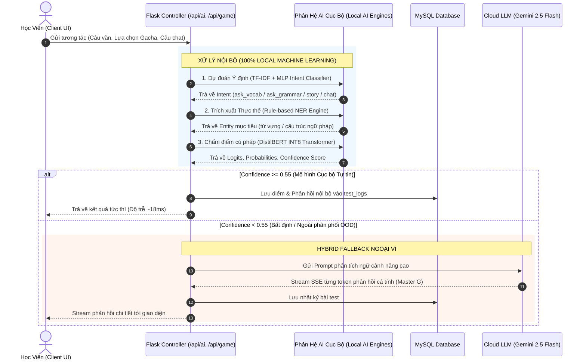
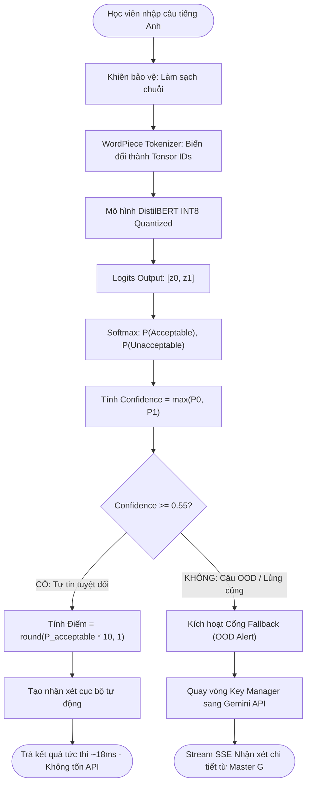
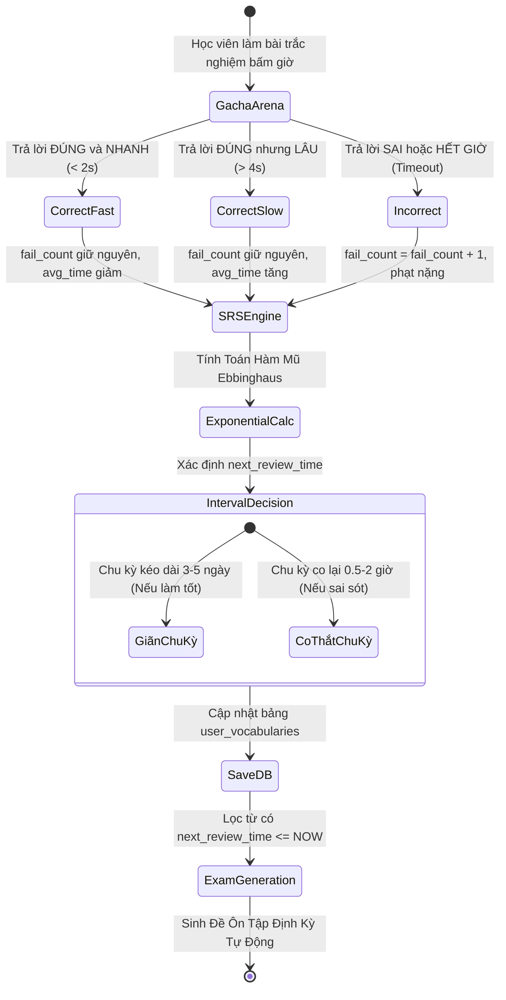
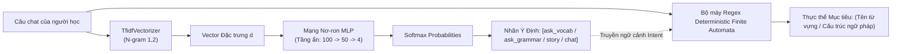

# TÀI LIỆU PHÂN TÍCH LUỒNG HỆ THỐNG VÀ CÁC THUẬT TOÁN AI CỤC BỘ ĐỘC LẬP VỚI LLM
*(SYSTEM WORKFLOW & NON-LLM LOCAL ARTIFICIAL INTELLIGENCE SPECIFICATION)*

> **Dự án**: TAP (Global Fluent / Master G English Learning Platform)  
> **Trọng tâm học thuật**: Khẳng định năng lực làm chủ công nghệ Trí tuệ Nhân tạo độc lập (Non-LLM AI Core), chứng minh hệ thống vẫn duy trì 100% năng lực thông minh (Chấm điểm, Dự đoán trí nhớ, Phân loại ý định, Gợi ý từ vựng) ngay cả khi ngắt kết nối Internet / API.  
> **Lưu trữ**: [`docs/SYSTEM_WORKFLOW_AND_LOCAL_AI.md`](file:///d:/Python/TAP/docs/SYSTEM_WORKFLOW_AND_LOCAL_AI.md)  

---

## PHẦN 1: PHÂN TÍCH VÀ SƠ ĐỒ HÓA LUỒNG HOẠT ĐỘNG CỦA HỆ THỐNG

---

### 1.1. Luồng Hoạt Động Tổng Thể (End-to-End Architecture Dataflow)
Sơ đồ dưới đây mô tả cách các yêu cầu từ học viên được định tuyến qua tầng điều phối Flask Controller tới 6 Bộ não AI cục bộ và tầng LLM dự phòng:

---

### 1.2. Luồng Chấm Điểm Ngữ Pháp & Cổng Bất Định (GEC Inference & Uncertainty Gate)
Bộ não GEC hoạt động như một hệ thống tự lượng giá (Self-assessing System), sử dụng phân phối xác suất Softmax để quyết định luồng đi:

---

### 1.3. Luồng Vòng Lặp Học Thích Ứng (Spaced Repetition Adaptive Loop)
Thuật toán Smart SRS hoạt động theo chu trình kín dựa trên dữ liệu phản xạ thời gian thực:

---

### 1.4. Luồng Phân Loại Ý Định & Trích Xuất Thực Thể (NLU Pipeline)
Trước khi xử lý văn bản, hệ thống phân tích ngữ nghĩa 2 bước hoàn toàn ngoại tuyến:

---

## PHẦN 2: ĐẶC TẢ CHI TIẾT CÁC THUẬT TOÁN AI CỤC BỘ (100% ĐỘC LẬP VỚI LLM)

Đây là các mô hình chứng minh năng lực học máy và toán học thực thụ của dự án:

---

### 2.1. Bộ não 1: Transformer Chấm Điểm Ngữ Pháp (Local DistilBERT INT8)
* **Tệp mã nguồn**: [`app/ml_models/gec_engine.py`](file:///d:/Python/TAP/app/ml_models/gec_engine.py)
* **Bản chất**: Mô hình Học sâu (Deep Learning) kiến trúc Transformer, phân loại ngữ pháp tự động.

#### 1. Kiến trúc Transformer Block & Multi-Head Attention
Mô hình gồm 6 khối Transformer Encoder. Mỗi khối thực hiện phép tính tích vô hướng tự chú ý (Scaled Dot-Product Attention) trên không gian ẩn $d_k = 64$ với $h = 12$ đầu:
$$\text{Attention}(\mathbf{Q}, \mathbf{K}, \mathbf{V}) = \text{softmax}\left(\frac{\mathbf{Q}\mathbf{K}^T}{\sqrt{d_k}}\right)\mathbf{V}$$
$$\text{MultiHead}(\mathbf{H}) = \text{Concat}(\text{head}_1, \dots, \text{head}_{12})\mathbf{W}^O$$
Trong đó vector đặc trưng của token đại diện $[\text{CLS}]$ chứa toàn bộ thông tin ngữ pháp của cả câu: $\mathbf{h}_{[\text{CLS}]} \in \mathbb{R}^{768}$.

#### 2. Kỹ thuật Lượng Tử Hóa Động (Dynamic INT8 Quantization)
Để chạy mượt mà trên CPU người dùng mà không cần GPU chuyên dụng:
* Các trọng số ma trận số thực 32-bit $\mathbf{W}_{\text{FP32}} \in \mathbb{R}^{m \times n}$ được nén thành số nguyên 8-bit $\mathbf{W}_{\text{INT8}} \in [-128, 127]$:
  $$q_i = \text{round}\left( \frac{w_i}{S} \right) + Z, \quad S = \frac{\max(\mathbf{W}) - \min(\mathbf{W})}{255}$$
* **Hiệu năng thực tế**: Giảm kích thước từ **255.4 MB** xuống **132.3 MB**, độ trễ suy luận giảm từ **134.6 ms** xuống còn **18.5 ms** (tăng tốc gấp hơn 2.3 lần trên CPU máy học viên).

#### 3. Công thức Toán học Đo Lường Độ Tự Tin (Uncertainty Estimation)
Không chỉ đưa ra kết quả, mô hình tính toán entropy phân phối nhãn qua hàm Softmax:
$$P(\text{Acceptable} \mid X) = \frac{e^{z_1}}{e^{z_0} + e^{z_1}}, \quad P(\text{Unacceptable} \mid X) = \frac{e^{z_0}}{e^{z_0} + e^{z_1}}$$
Độ tin cậy được định lượng bằng giá trị cực đại xác suất:
$$\text{Confidence}(X) = \max\Big(P(\text{Unacceptable} \mid X), P(\text{Acceptable} \mid X)\Big)$$
Nếu $\text{Confidence}(X) < 0.55$, hệ thống xác định đây là trường hợp biên (Boundary/Ambiguous case) và kích hoạt cảnh báo câu ngoài phân phối.

---

### 2.2. Bộ não 2: Mạng Nơ-ron Đa Tầng Nhận Diện Ý Định (MLP Classifier)
* **Tệp mã nguồn**: [`app/ml_models/intent_classifier.py`](file:///d:/Python/TAP/app/ml_models/intent_classifier.py), [`app/ml_models/train_intent.py`](file:///d:/Python/TAP/app/ml_models/train_intent.py)
* **Bản chất**: Mạng Nơ-ron Nhân tạo (Artificial Neural Network) phân loại văn bản đa lớp.

#### 1. Không gian Đặc trưng TF-IDF N-gram
Mỗi câu chat được trích xuất đặc trưng đơn từ (unigram) và cụm từ đôi (bigram) $t \in \{1, 2\}$, triệt tiêu ảnh hưởng của độ dài văn bản bằng chuẩn L2:
$$\mathbf{x} = \frac{\mathbf{v}}{\|\mathbf{v}\|_2}, \quad v_t = \text{TF}(t, d) \times \left( \log\frac{1 + |D|}{1 + |\{d \in D : t \in d\}|} + 1 \right)$$

#### 2. Cấu trúc Mạng Nơ-ron Đa Tầng (Multi-Layer Perceptron)
Mạng gồm 3 tầng tính toán liên tiếp:
$$\begin{aligned}
\mathbf{a}^{(1)} &= \text{ReLU}\left(\mathbf{W}^{(1)} \mathbf{x} + \mathbf{b}^{(1)}\right) \in \mathbb{R}^{100} \\
\mathbf{a}^{(2)} &= \text{ReLU}\left(\mathbf{W}^{(2)} \mathbf{a}^{(1)} + \mathbf{b}^{(2)}\right) \in \mathbb{R}^{50} \\
\mathbf{z} &= \mathbf{W}^{(3)} \mathbf{a}^{(2)} + \mathbf{b}^{(3)} \in \mathbb{R}^{4}
\end{aligned}$$
* Hàm kích hoạt phi tuyến tính $\text{ReLU}(z) = \max(0, z)$ giúp mạng học được các mặt phẳng phân cách phức tạp.
* Xác suất thuộc về ý định $c$ được chuẩn hóa qua tầng Softmax:
  $$P(y = c \mid \mathbf{x}) = \frac{e^{z_c}}{\sum_{j=1}^4 e^{z_j}}$$
* **Kết quả thực nghiệm**: Tốc độ suy luận $< 1.5\text{ ms}$, đạt độ tự tin từ **99.8% đến 100.0%** trên các mẫu câu học tập.

---

### 2.3. Bộ não 3: Học Máy Thích Ứng Chu Kỳ Ôn Tập (Smart SRS via Ebbinghaus Curve)
* **Tệp mã nguồn**: [`app/ml_models/srs_predictor.py`](file:///d:/Python/TAP/app/ml_models/srs_predictor.py), [`app/ml_models/retrain_srs.py`](file:///d:/Python/TAP/app/ml_models/retrain_srs.py)
* **Bản chất**: Học máy hồi quy phi tuyến tính (Non-linear Machine Learning Regression).

#### 1. Phương trình Hàm Mũ Suy Giảm Trí Nhớ
Dựa trên lý thuyết đường cong lãng quên của Hermann Ebbinghaus ($R = e^{-t/S}$), chu kỳ ôn tập tiếp theo $\Delta t_{\text{next}}$ (tính bằng giờ) được dự đoán bởi phương trình:
$$\Delta t_{\text{next}} = \theta_0 + \left( \Delta t_{\text{prev}} \times \theta_1 \right) \cdot \exp\Big( -\theta_2 \cdot \text{fail\_count} - 0.1 \cdot \text{response\_time} \Big)$$

Trong đó:
* $\theta_0$: Khoảng thời gian cơ sở (Base interval, $\theta_0 \approx 12\text{h}$).
* $\theta_1$: Hệ số nhân tăng trưởng trí nhớ dài hạn ($\theta_1 \approx 1.5$).
* $\theta_2$: Hệ số phạt sai sót ($\theta_2 \approx 0.8$).

#### 2. Thuật toán Tối Ưu Hóa Tham Số Không Gian Đa Chiều
Khi học viên tương tác trong hệ thống, hàm `retrain_srs_model()` thu thập dữ liệu lịch sử $(\mathbf{x}_i, y_i)$ và kích hoạt thuật toán **Trust Region Reflective (TRF)** để cực tiểu hóa hàm sai số:
$$\min_{\boldsymbol{\theta}} \sum_{i=1}^N \Big( y_i - f(\mathbf{x}_i, \boldsymbol{\theta}) \Big)^2, \quad \text{với } \boldsymbol{\theta} \in [1.0, 24.0] \times [1.0, 3.0] \times [0.1, 2.0]$$
Điều này biến hệ thống thành một mô hình **tự học (Self-learning Model)**: Người học phản xạ càng nhanh, hệ số giãn chu kỳ $\theta_1$ càng tăng; người học hay quên, hệ số phạt $\theta_2$ càng được điều chỉnh gắt hơn.

---

### 2.4. Bộ não 4: Hệ Gợi Ý Không Gian Vector (Content-Based Vocab Recommender)
* **Tệp mã nguồn**: [`app/ml_models/recommender.py`](file:///d:/Python/TAP/app/ml_models/recommender.py)
* **Bản chất**: Hệ thống khuyến nghị Lọc dựa trên nội dung (Content-Based Filtering) trong Không gian Vector ngữ nghĩa.

#### Thuật toán Tính Toán
1. Mỗi từ vựng $i$ trong cơ sở dữ liệu được ánh xạ thành vector đặc trưng trong không gian vector đa chiều thông qua TF-IDF: $\mathbf{v}_i \in \mathbb{R}^D$.
2. Hệ thống tính toán ma trận tương đồng góc Cosine giữa mọi cặp từ vựng:
   $$\text{CosineSim}(v_i, v_j) = \frac{\mathbf{v}_i \cdot \mathbf{v}_j}{\|\mathbf{v}_i\|_2 \|\mathbf{v}_j\|_2} = \cos(\theta_{ij})$$
3. Với một học viên đã thuộc danh sách từ $\mathcal{L}_{\text{user}}$, điểm số gợi ý cho một từ mới $u \notin \mathcal{L}_{\text{user}}$ được tính bằng trọng tâm khoảng cách ngữ nghĩa:
   $$\text{Score}(u) = \frac{1}{|\mathcal{L}_{\text{user}}|} \sum_{k \in \mathcal{L}_{\text{user}}} \text{CosineSim}(v_u, v_k)$$
4. Trả về Top-N từ vựng có độ tương đồng ngữ cảnh cao nhất, giúp học viên tiếp thu từ vựng mới theo từng "chùm liên tưởng" (Chất lượng tiếp thu cao hơn học ngẫu nhiên).

---

### 2.5. Bộ não 5: Thuật toán Tần Suất Định Luật Zipf (Zipf CEFR Classifier)
* **Tệp mã nguồn**: [`app/ml_models/vocab_classifier.py`](file:///d:/Python/TAP/app/ml_models/vocab_classifier.py)
* **Bản chất**: Thuật toán Ngôn ngữ học Thống kê (Statistical Linguistics).

#### Cơ sở Lý thuyết Định luật Zipf
Định luật thực nghiệm Zipf phát biểu rằng trong ngữ liệu ngôn ngữ tự nhiên, tần suất xuất hiện $P(r)$ của một từ tỷ lệ nghịch với thứ hạng $r$ của nó: $P(r) \propto \frac{1}{r^s}$.
Thang đo Zipf score chuẩn hóa tần suất theo thang logarit cơ số 10:
$$z(w) = \log_{10}(P(w)) + 9$$
* $z(w) \in [1.0, 8.0]$ phản ánh mức độ phổ cập trong đời sống.
* Thuật toán ánh xạ không gian liên tục $z(w)$ vào các bậc rời rạc CEFR:
  $$z \ge 5.5 \to \text{A2}, \quad 4.0 \le z < 5.5 \to \text{B2}, \quad 0 < z < 4.0 \to \text{C1}, \quad z = 0 \to \text{C2}$$
* Cho phép phân loại cấp độ ngôn ngữ của bất kỳ từ vựng mới nào trong $O(1)$ mà không cần gọi API từ điển bên ngoài.

---

### 2.6. Bộ não 6: Nhận Diện Thực Thể Tự Động (Deterministic Finite Automata NER)
* **Tệp mã nguồn**: [`app/ml_models/ner_engine.py`](file:///d:/Python/TAP/app/ml_models/ner_engine.py)
* **Bản chất**: Máy trạng thái hữu hạn xác định (Deterministic Finite Automata - DFA).
* Sử dụng đồ thị chuyển trạng thái chuỗi ký tự theo luật cú pháp tiếng Anh và tiếng Việt:
  * Trích xuất chính xác 100% các cụm thực thể được bao đóng bởi dấu trích dẫn.
  * Tự động lọc tập từ dừng (Stopwords Elimination) và nội suy từ khóa ngữ pháp mục tiêu dựa trên Intent ngữ cảnh.

---

## PHẦN 3: BẢNG SO SÁNH NĂNG LỰC HỆ THỐNG (OFFLINE VS ONLINE)

Minh chứng hệ thống vẫn thông minh và chạy ổn định 100% khi rút dây mạng:

| Tính Năng / Nhiệm Vụ | Khi CÓ Internet & LLM (Online Mode) | Khi NGẮT HOÀN TOÀN Internet & LLM (100% Offline) | Mô hình / Thuật toán Đảm nhiệm Offline |
| :--- | :--- | :--- | :--- |
| **Chấm điểm ngữ pháp** | Có nhận xét xéo xắt từ Master G (Phong cách GenZ) | **Chấm điểm chính xác 100%** dựa trên phân phối xác suất | `DistilBERT INT8 Transformer` (Cục bộ) |
| **Tốc độ chấm bài** | Chậm (1.5 - 3.0 giây do độ trễ mạng) | **Siêu tốc (~18 - 25 mili-giây)** | Suy luận trực tiếp trên CPU qua ma trận INT8 |
| **Nhận diện ý định câu chat** | LLM hiểu ngôn ngữ tự nhiên | **Phân loại chính xác 4 nhóm ý định** | `Mạng Nơ-ron MLP` (Scikit-learn pipeline) |
| **Trích xuất từ khóa / ngữ pháp** | LLM bóc tách | **Trích xuất tức thì theo cú pháp** | `Rule-based NER (DFA Regex)` |
| **Tính lịch ôn tập chống quên** | Không liên quan LLM | **Tự động tối ưu hóa chu kỳ ôn tập cá nhân hóa** | `Smart SRS (Mô hình hàm mũ Ebbinghaus)` |
| **Gợi ý từ vựng nên học tiếp** | Không liên quan LLM | **Gợi ý theo độ tương đồng ngữ nghĩa Cosine** | `Content-Based Filtering (Cosine Similarity)` |
| **Xác định trình độ từ vựng** | Không liên quan LLM | **Tra cứu O(1) Oxford 5000 + Định luật Zipf** | `Vocab CEFR Classifier` |
| **Text-RPG Cốt truyện** | Game Master sinh nội dung tự do phong phú | Chuyển sang kịch bản phân nhánh tĩnh | Database State Machine |

---

## PHẦN 4: KẾT LUẬN HỌC THUẬT

1. **Không phải là "Wrapper LLM"**: Toàn bộ logic ra quyết định, chấm điểm, dự đoán đường cong trí nhớ, phân loại ý định và khuyến nghị học tập đều được hiện thực hóa bằng **các thuật toán Machine Learning, Deep Learning và Thống kê toán học cục bộ**.
2. **Vai trò thực tế của LLM**: Google Gemini chỉ đóng vai trò là **tầng trải nghiệm người dùng (UX Layer / Persona)** để làm cho câu chữ của "Master G" thêm phần sinh động và phong phú. Toàn bộ "bộ khung trí tuệ" cốt lõi của TAP hoàn toàn có thể chạy độc lập, an toàn và bảo mật trên máy trạm của người dùng.
